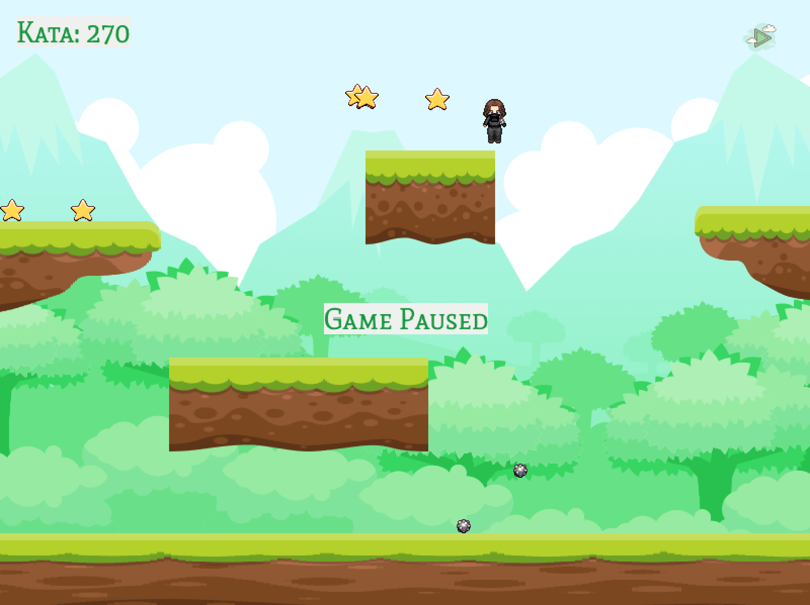
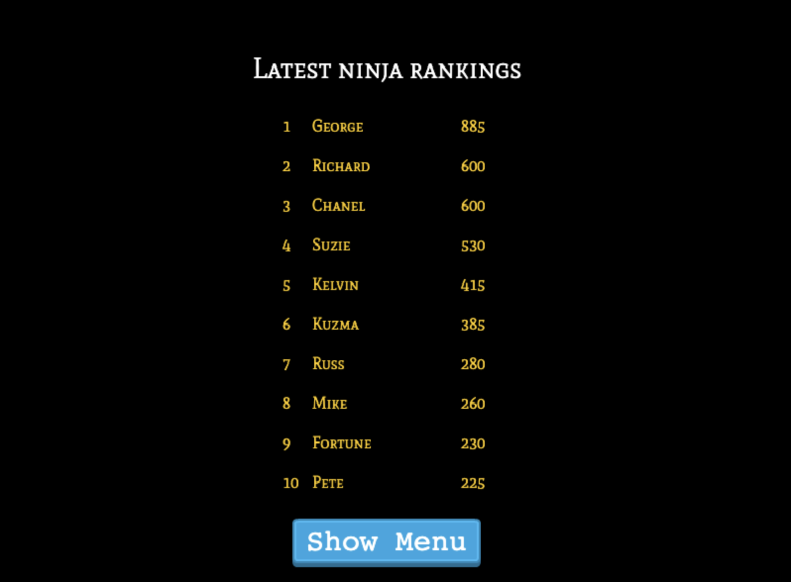

# Ninja 2d

## Live Link
[Click here](https://ninja2d.netlify.app/) to start your quest 🥷🏼

## Objectives:
- Implementing a creative game with Phaser
- Working with APIs
- Using ES6+, Async functions and Promises
- Functional programming
- Principles of Object-oriented design
- Code organization with ES6 modules in Javascript
- Using Webpack for bundling Javascript modules
- DOM manipulation
- Test driven development

## Features
Ninja 2d is a platform game created with the Phaser 3 library. On first visit, the game boots, initializing all assets. The menu appears next with four selections, `Play, Options, Rankings and Credit`. Background music can be turned on and off as desired by checking the `Music enabled` option. The credit scene acknowledges the developer of Ninja 2d. To play, select `Play`. The ninja has to collect fallen stars amidst moving platforms. A level is complete when there are no more stars and a new level starts immediately. The scoring system is simple: 1 fallen star represents 5 `kata`. Users face the daunting task of accumulating `kata` as more obstacles appear with each level. Navigate the course with cursor `up, left and right` keys. Press the `up` arrow key twice to double jump from any platform. After each game, users can upload their achievements and see how they compare with the top ten ninjas in this exciting 2d world. 

## Prerequisites
- Internet Connection
- Chrome and Firefox. Internet Explorer is not supported and only partial support is available on Safari
- Support available for screen sizes equal to and larger than iPad Mini(landscape)
- An Integrated Development Environment
- Node Package Manager [(NPM)](https://docs.npmjs.com/about-npm)

## Tools/Built With
- JavaScript ES6+
- Phaser 3.55
- Webpack
- Bootstrap
- HTML5/CSS3
- NPM

## Getting Started
[Ninja 2d](https://ninja2d.netlify.app/) is deployed to Netlify and a unique identifier was allocated from the Leaderboard API backend after creating the game. However, to manage locally, follow these steps:
- Clone this project by running `git clone https://github.com/george-swift/ninja.git` in a desired directory
- `cd` into the directory of the cloned project and run `npm install` to install required dependencies
- Create a `.env` file in the root directory with the following content `GAME_ID=QQUigteP76PAUEtOsMwy` and save it.
- Automation scripts are included in the package file to ease development. Each build stage was tested using the Jest test framework. Run `npm test` to get a verbose report of individual test executions.
- If all tests pass, run `npm start` to fire up a local server with live reloading.
- If not already redirected, visit `http://localhost:8080/` in your browser to access Ninja 2d from your server.
- To terminate the server, enter `Ctrl + C` in your terminal

## Authors

👤 &nbsp; **Ubong George**
- LinkedIn: [Ubong George](https://www.linkedin.com/in/ubong-itok)
- Twitter: [@\_\_pragmaticdev](https://twitter.com/__pragmaticdev)
- GitHub: [@george-swift](https://github.com/george-swift)

## Game Design Documentation

### Project scope &nbsp;📐 

**Timeline:**
* Day 1: Familiarise with API documentation in Phaser 3.55 library
* Day 2: Game story, character identification and overall design objective
* Day 3: Test-driven implementation of game logic following design objectives
* Day 4: Deployment to hosting service

### Gameplay & mechanics &nbsp;⚙️

**Basic Movement**

* Details: The ninja can move left, right, and jump from any platform
* How it works: Controls for movement is via keyboard left, right, and up arrow keys

**Double Jumps**

* Details: The ninja can perform double jumps from a rest position. This is incredibly useful for avoiding obstacles or navigating moving platforms
* How it works: Press the UP arrow key twice 

**Levels**

* Details: After all fallen stars are collected, a new level is immediately started and obstacles appear. Difficulty increases with each level
* How it works: After the first round, bombs appear. When kata is more than 250, bombs bounce higher. Touching a bomb means game over.

**Leaderboard**

* Details: Rankings show the top ten players with the highest kata in Ninja 2d. The Leaderboard API service is integrated with gameplay.
* How it works: After each game, a player fills in their name to upload their achievements to the backend. 

**👤 Characters**
* Ninja

**🗺️ Locations**
* Ninja world

**🏆️ Levels / Mission**
* ∞ levels
* Accumulate as much kata as it takes to be the top-ranking ninja

**📦️ Objects**
* Static and moving platforms
* Fallen stars
* Bombs

## Acknowledgments

🎨 **Art**

- Platforms and background from [Game Art](https://www.gameart2d.com/)
- Ninja [spritesheet](https://untamed.wild-refuge.net/images/rpgxp/)

🔊 **Audio**

- Background music by [FoxSynergy](https://opengameart.org/content/8-bit-ninja)

📚 **WebGL**
- Phaser [library](http://phaser.io/)

## Show your support

Leave a :star:️ &nbsp; if you like this project!

## License

Available as open source under the terms of the [MIT License](https://opensource.org/licenses/MIT).
